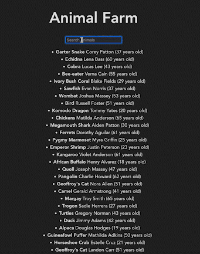

# Animal Farm testing Vite

Plain React with a single file Express to test Vite speed 

For client side 
```
npm i
npm run dev
```

For server side 
```
cd server
npm i
npm . or npm index.js
```

## Used ()s
* Seperte logic with UI using Custom Hook
* useEffect to store previous query (localS)
* useState to store query result from animals, setAnimals

